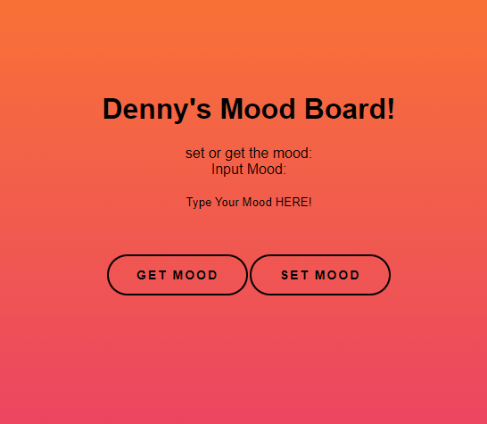

# Mood Dapp

This is a simple Decentralized Application that demonstrates simple concepts on how to link smart contracts to the front-end. 
 Utilizing tools such as [Remix](https://remix.ethereum.org/) and [MetaMask](https://metamask.io/)

## Acknowledgements

 - [BlockDevsUnited/BasicFrontEndTutorial](https://github.com/BlockDevsUnited/BasicFrontEndTutorial)
 - [LearnWeb3](https://www.learnweb3.io/)

## Tech Stack

**Client:** HTML, CSS, Solidity

**Server:** Live-Server

## Screenshots

